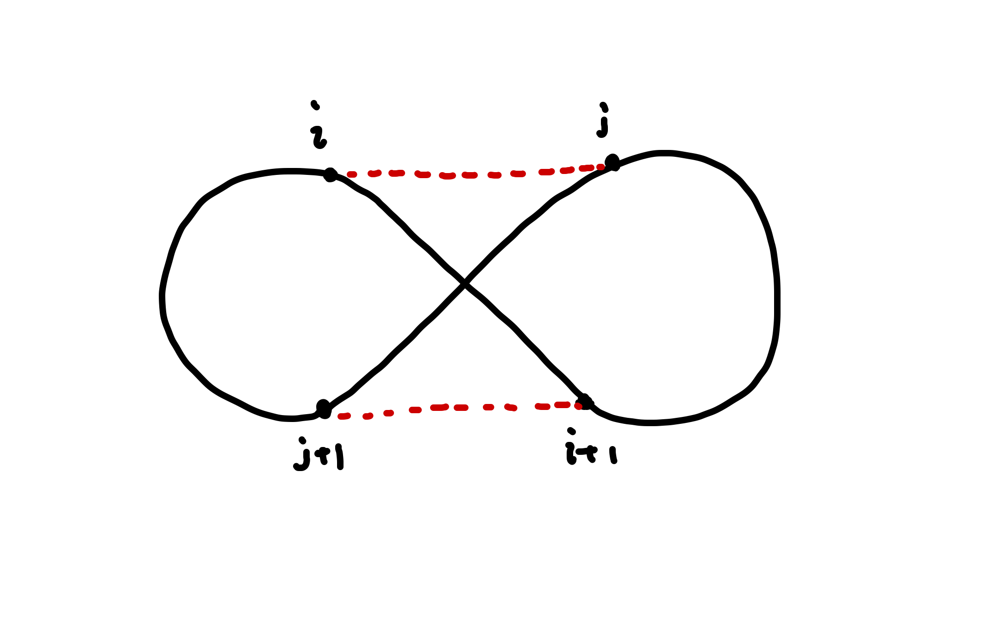
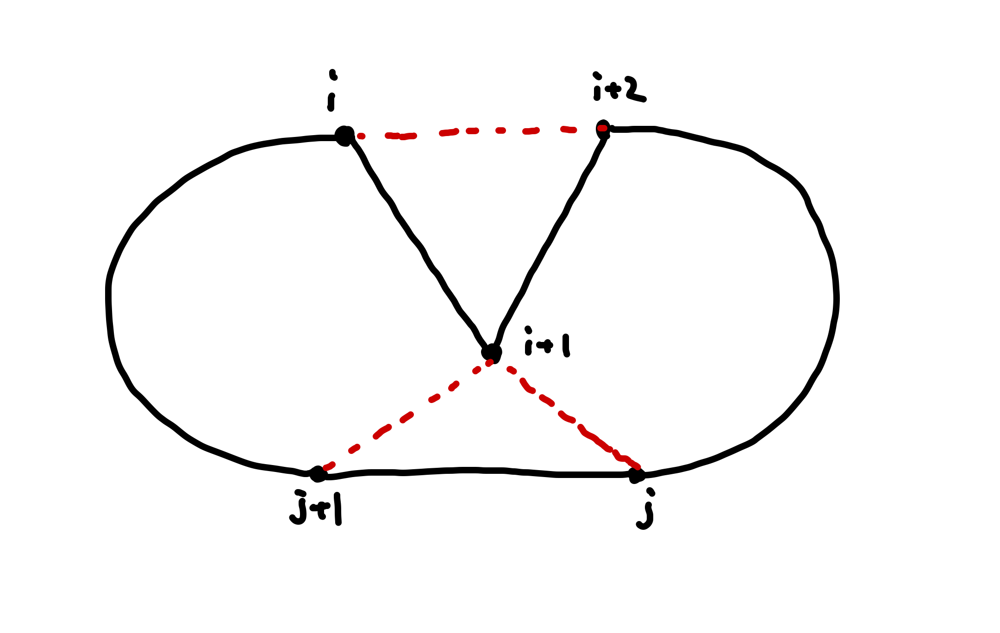
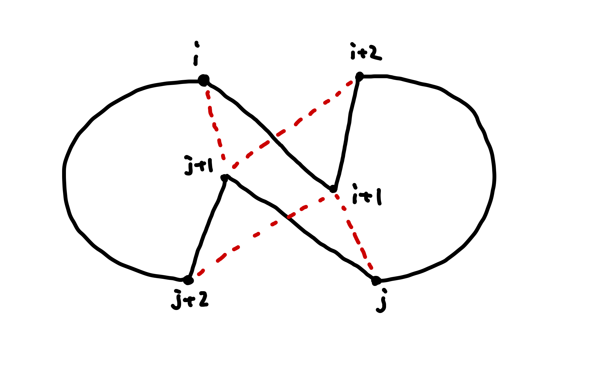

# Google STEP 2021: Travelling Salesman Problem Challenges

## プログラム

solver_greedy_change: CHANGE1+CHANGE2  
solver_greedy_upgrade: greedy+CHANGE1  
solver_greedy_final: greedy*(CHANHE1+CHANGE2)

## GREEDY
Greedyの開始点によって結果は変わってくるため、一番短い結果になるように全ての開始点からgreedyをする。
upgradeでは、greedyでの経路が一番短くなるもの、に以下のCHANGEを施しているが、finalでは、greedyで開始点からの経路を繋いだのちCHANGEを施したものが最短になるもの、を見つけている。
greedyでの結果が最短だからといって、CHANGEを施しても最短とは限らない。
(一番最初に思いつきそうなアイデアだが、最後に思いついた。)

## CHANGE1


i-i+1間距離+j-j+1間距離がi-j間距離+i+1-j+1間距離よりも長ければ、図のようにつなぎかえる。
授業中に示されたことを実行しただけだが、実装に詰まってかなり調べてしまいました。すみません。

## CHANGE2


i-i+1間距離+i+1-i+2間距離+j-j+1間距離+j+1-j+2間距離がi-j+1間距離+j+1-i+2間距離+j-i+1間距離+i+1-j+2間距離よりも長ければ、図のようにつなぎかえる。
改善方法が浮かばなくてvisualizerでgreedyとsaを比べていたら思いついた。しかしほぼCHANGE1と発想は似てる

## CHANGE3 (没)


他のCHANGEと同じく「より短い経路があればそれにつなぎかえる」ことを、図のような場合で考え、実装しようとした。
ところが改善が見られなかった。おそらくCHANGE2を踏んだ段階でこの図のような状況が生まれからだろう。(少なくともこの図はCHANGE2で改善される。)
それはともかく、このパートの一部の場合分けで、改善するどころかスコアが悪化したのに何が悪いかわからないという問題が起こっている。
それだけはどうにかしたい。(きちんとできていたら改悪するわけはない。)

### Visualizer

The demo page of the visualizer is
[here](https://hkocinneide.github.io/google-step-tsp/visualizer/build/default/).

The assignment includes a helper Web page,
`visualizer/build/default/index.html`, which visualizes your solutions. You need
to run a HTTP server on your local machine to access the visualizer. Any HTTP
server is okay. If you are not sure how to run a web server, use the following
command to run the HTTP server. Make sure that you are in the top directory of
the assignment before running the command.

```shellsession
python -m http.server # For Python 3
python -m SimpleHTTPServer 8000 # If you don’t want to install Python 3
```

Then, open a browser and navigate to the
[http://localhost:8000/visualizer/build/default/](http://localhost:8000/visualizer/build/default/).

Visualizer was only tested by Google Chrome. Using the visualizer is up-to you.
You don’t have to use the visualizer to finish the assignment. The visualizer is
provided for the purpose of helping you understand the problem.

See
[GitHub Help](https://help.github.com/articles/configuring-a-publishing-source-for-github-pages/)
to know how to enable GitHub pages on your repository.

## 反省
・パーツに分けるのを忘れた。  
さあ書くぞ！となっていきなり書き始めてしまった。多分具体的に何を書くか決める前に取り合えず書こうとしたのが一つの原因。  
始める前に大枠を決めてから(関数の役割を決めてから)書き始めるようにしたい。(意識しないとすぐ忘れる。)
とりあえずコメントを書いたら多少見やすくはなったが、さらに改善するときにメンテナンスがしにくくなりそう。  
  
・寝ている間に働いてくれないパソコン。  
パソコンに自分が寝ているときに働かせようとしたのにスリープして働いてくれない。スリープしない設定にしたはずなのに。  
一方で寝てすぐに実行が終わった場合パソコンがつきっぱなしになって環境に悪い。パソコンにも悪い。
プログラムの実行が終わったらスリープするプログラムを書けたらいいなと思った。
